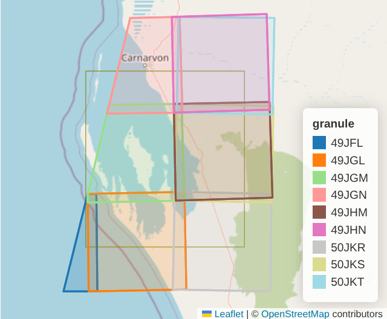

# GeoAnchor, GeoTile, GeoStack

Core data types the rest of the library builds on. This page assumes
nothing about the codebase — just what a geospatial raster is, and how
these three types represent one. See [pipeline.md](pipeline.md) for how
they get built in practice and [model.md](model.md) for how they become
training tensors.

## What is geospatial data

Plain version: **a value that belongs to a place, and sometimes also to a
time.**

- "Value" — a number, a pixel, a whole grid of pixels, a label, whatever
  you're storing.
- "Belongs to a place" — that value means something *there* and nowhere
  else. Temperature 24°C means nothing on its own; 24°C in Jakarta right
  now does.
- "Sometimes also a time" — a lot of geospatial data changes over time
  (a satellite photo, today's temperature). Some doesn't (a country
  border). Time is optional; place is not — that's what makes it
  *geospatial* data instead of just data.

Everything below is that one idea, wearing different clothes depending on
how much of it you're carrying and what you're about to do with it.

## What is a geospatial raster

A geospatial raster is a grid of pixel values that also knows where on
Earth it sits — two things on top of a plain image array:

- **Location** — a coordinate reference system (CRS) plus an affine
  transform, mapping pixel `(row, col)` to a real-world `(x, y)`. This is
  what makes "row 0, col 0" mean something like "562990, 10001360 in UTM
  zone 49S," not just "top-left corner of some image."
- **Resolution** — how many meters (or degrees) one pixel covers.

A raster can also carry more than one **band** (Sentinel-2 imagery has 13:
red, green, blue, near-infrared, ...), and more than one **timestamp**, if
you're tracking the same area across a season.

A raster can consist of many stac items mgrs grid, and sometimes there are
a portions of the raster that does not have stac items covered, no data.



## GeoAnchor — an area and a time, no pixels yet

Before any pixel exists, you need a way to say "I want this area, at this
time." That is all a `GeoAnchor` is:

```python
from geosave_engine.geodata.spatial import GeoAnchor

anchor = GeoAnchor.from_coordinate(
    latitude=-6.2088, longitude=106.8456,  # Jakarta
    size_m=5000,                            # 5 km box centered on that point
    resolution=10,                          # each pixel covers 10 m
    datetime="2026-06-02",
)
```

Location and datetime, nothing else — no pixels attached. It is the unit of
"what to go fetch": every catalog search or file read starts from one of
these.

In terms of the definition above: a `GeoAnchor` is place + time with no
value yet. It is not geospatial data itself — it's the address you attach
a value to, to get some.

An anchor doesn't have to come from a point + radius. Same idea, three other
starting shapes:

```python
GeoAnchor.from_polygon(polygon, datetime="2026-06-02")       # exact AOI shape, not just its bbox
GeoAnchor.from_geojson("aoi.geojson", datetime="2026-06-02") # one anchor per feature in the file
GeoAnchor.from_bbox((106.8, -6.3, 106.9, -6.1), datetime="2026-06-02")  # raw bounding box
```

## The data itself — bands, x, y, time

Once pixels get fetched (or computed) for an anchor, they land in an array
with 3 or 4 labeled dimensions: `band`, `y`, `x`, and `time` if the anchor
spans more than one scene.

That array is an [`xarray.DataArray`](https://docs.xarray.dev/) — a numpy
array where every dimension is a *labeled axis*, not a bare index you have
to remember the position of:

```python
tile.data.sel(band="B04")           # the red band, by name, not "index 2"
tile.data.sel(time="2026-06-02")    # one date, if a time dimension is present
tile.data.shape                     # (band, y, x), or (time, band, y, x)
```

Reading a tile is lazy — opening it reads geometry and datetime from
metadata only; the pixel values themselves stay on disk (or over the
network) until something actually asks for them:

```python
from geosave_engine.geodata.spatial import GeoTile

tile = GeoTile.from_zarr("sentinel_2_l1c.zarr")  # fast — no pixels touched yet
tile.data.shape                                   # still fast — shape is metadata
array = tile.to_numpy()                           # this line is what actually reads pixels
```

A `GeoAnchor` with this array attached is a `GeoTile` — same area and time
as the anchor it came from, plus the pixels. This is the definition from
the top of this page, made concrete: place + time (the anchor) + value
(the pixels) = one piece of geospatial data. `GeoTile` is the smallest
whole unit of it this library hands you — you can attach pixels you
computed yourself, too — a cloud mask or NDVI derived from a tile you
already have, without a second fetch:

```python
cloud_mask = anchor.to_geotile(mask_array)  # anchor -> GeoTile, no new fetch
```

## GeoStack — several rasters, one area and time, together

A single satellite scene rarely gives you everything one training sample
needs — usually imagery, a cloud mask, maybe a label raster, all covering
the *same* anchor. A `GeoStack` holds those layers together, one name each.
It isn't a new kind of geospatial data — it's several `GeoTile`s (several
values) at the same place and time, carried together under one name each:

```python
from geosave_engine.geodata.spatial import GeoStack

stack = GeoStack(
    sentinel_2_l1c=image_tile,  # (band=9, y, x)
    cloud_mask=mask_tile,       # (band=1, y, x)
    dynamicworld=label_tile,    # (band=1, y, x)
)
stack.to_zarr("data/train/13.0000E_52.0000N_5kmx5km_20240101_10m.zarr")
```

Every layer gets snapped onto one shared pixel grid when the stack is
built — same resolution, same bounds — so pixel `(0, 0)` in
`sentinel_2_l1c` is the same real-world spot as pixel `(0, 0)` in
`dynamicworld`. That guaranteed overlap is what makes a stack usable as one
training sample: model input and label, always aligned.

### The `.zarr` store convention

`save`/`load` require the path to end in `.zarr`. Each layer writes as its
own Zarr *group* inside that one store — not a separate file:

```text
13.0000E_52.0000N_5kmx5km_20240101_10m.zarr/
├── sentinel_2_l1c/
├── cloud_mask/
└── dynamicworld/
```

That suffix is what lets a whole ingested directory be scanned for anchors
with one glob, at any nesting depth, without mistaking a stray unrelated
`.zarr` store elsewhere in the tree for a real anchor:

```python
list(Path("data/train").rglob("*.zarr"))
```

So ingested output can mirror a raw dataset's own folder structure — by
biome, by split, whatever the source layout is — with no extra bookkeeping.

`save` also takes `overwrite` (default `True`) — each layer writes to its
own Zarr *group*, so saving only replaces the groups this stack actually
carries, leaving any other layer already in the store untouched. Passing
`overwrite=False` instead raises if a layer name in this stack already has
a group in the store, rather than silently replacing it.

## Small vs big: datasets vs datastore

`GeoTile`/`GeoStack` always hand you the *whole* value — every pixel,
loaded into memory, the moment you ask. That's the right behavior for a
training patch: it's small on purpose (a few hundred pixels a side), and a
model needs the whole thing anyway to train on it.

It's the wrong behavior for a country-scale prediction raster — asking for
"the whole thing" there means gigabytes in memory for one request. Same
definition of geospatial data (place + time + value) — different amount of
it, and a different way of handing it over:

- **`geodata.datasets`** — reads whole `GeoTile`/`GeoStack` samples, keyed
  by sample id, for training. Assumes small. This is what "dataset" means
  everywhere in this codebase.
- **`geodata.datastore`** — reads a small *window* out of a big raster on
  request (e.g. one map tile at one zoom level), never the whole thing at
  once. For serving/viewing, not training.

Same underlying idea both places — a value tied to a place and time — just
two different contracts for how much of it you're handed per call.

## What's next

[pipeline.md](pipeline.md) — how anchors and tiles get built in practice:
pulling from a live STAC catalog or local files, deriving layers, handling
labels. [model.md](model.md) — how a saved `GeoStack` becomes a training
tensor.
