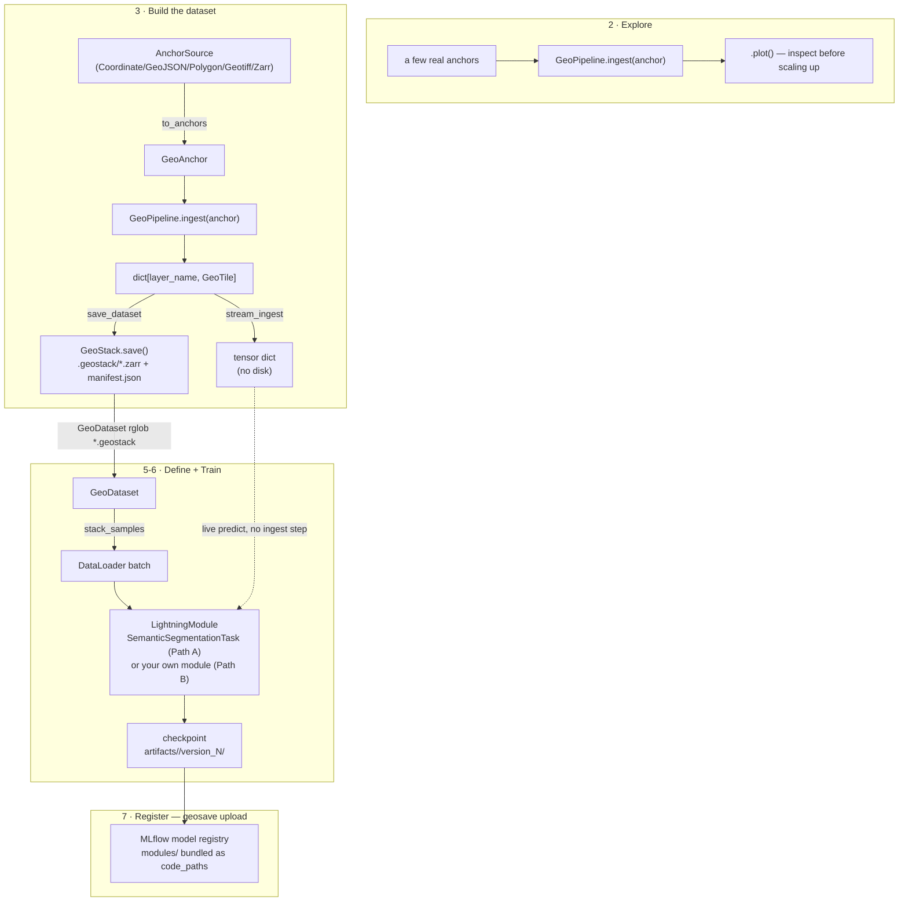

# AI Engineer Workflow

Step-by-step path through GeoSave Engine, from `geosave create` to a model
registered in MLflow — the ordered procedure, commands and outcomes.
Reference material (what things *are*, full API/arg tables) lives in
[docs/concept/](../concept/): [geotile.md](../concept/geotile.md)
(`GeoAnchor`/`GeoTile`/`GeoStack`), [pipeline.md](../concept/pipeline.md)
(`GeoPipeline`, sources, STAC), [model.md](../concept/model.md)
(`GeoDataset`, `SemanticSegmentationTask`/`DataModule`, config.yaml). This
doc links out to them where the mechanics get deep; read this one first.

## Status legend

| Tag | Meaning |
| --- | --- |
| 🟢 | Works today — described from code that exists and runs. |
| 🟡 | Convention, not code — a recommended practice using an external tool. GeoSave Engine doesn't wrap it or depend on it. |

## At a glance

1. [Set up the workspace](#1-set-up-the-workspace-) 🟢
2. [Explore and validate a pipeline](#2-explore-and-validate-a-pipeline-) 🟢
3. [Build the dataset](#3-build-the-dataset-) 🟢
4. [Version the ingested data with DVC](#4-version-the-ingested-data-with-dvc-) 🟡
5. [Define the model](#5-define-the-model-) 🟢
6. [Train](#6-train-) 🟢
7. [Register the model](#7-register-the-model-) 🟢



---

## 1. Set up the workspace 🟢

```bash
geosave create -d my-project
```

Writes a workspace at `my-project/`:

```text
my-project/
├── artifacts/     # checkpoints, logs, saved configs (created by training)
├── configs/       # LightningCLI YAML configs
├── data/          # ingested layers land here
├── logs/
├── modules/       # your pipeline (Path A); data module + lightning module too, if Path B
├── predictions/
├── .env           # CDSE credentials, filled in with placeholders
├── geosave.toml   # workspace identity (task/method/catalog), read by the CLI
└── main.py        # LightningCLI entry point — do not need to touch this
```

`.env` is copied in automatically with placeholder CDSE (Copernicus Data
Space Ecosystem) credentials:

```bash
AWS_S3_ENDPOINT=eodata.dataspace.copernicus.eu
AWS_ACCESS_KEY_ID=changethis
AWS_SECRET_ACCESS_KEY=changethis
```

Fill in your real key/secret before ingesting anything — your pipeline's
STAC client reads these the moment it's imported, so a missing or placeholder
credential fails at the first `ingest` call, not silently later.

In a real project you already have the URIs that matter — an S3 bucket for
COGs, an MLflow tracking server. Point your workspace at those directly by
setting the matching env vars (`MLFLOW_TRACKING_URI`, your S3 credentials in
`.env`). See [Train](#6-train-) for why `MLFLOW_TRACKING_URI` matters even
if you never touch MLflow code directly.

> **Optional: local sandbox infra.** `geosave infra` is not part of the main
> flow above — skip it entirely if you already have real S3/MLflow URIs. It
> exists only for developing against something production-like before real
> infrastructure exists: a disposable Postgres + S3-compatible storage +
> MLflow stack via docker compose.
>
> ```bash
> geosave infra init      # copies docker-compose.yml + .env to ./docker/, once
> geosave infra up -p mlflow
> ```

## 2. Explore and validate a pipeline 🟢

Write your `GeoPipeline` subclass — one `ingest(anchor) -> dict[layer_name,
GeoTile]` method, everything else optional. Full anatomy, the two kinds of
"source," pulling from a live STAC catalog vs. local GeoTIFF, building a
derived layer, handling labels: [concept/pipeline.md](../concept/pipeline.md).

Try it against a few real anchors before scaling up — `ingest(anchor)` is
pure, no I/O, no manifest, so this costs nothing:

```python
layers = MyPipeline().ingest(anchor)
layers["sentinel_2_l1c"].data.shape, layers["sentinel_2_l1c"].num_bands, layers["sentinel_2_l1c"].resolution
```

Then look at it, don't just inspect shapes. `geosave_engine.utils.geovis.plot`
(also reachable as `tile.plot(...)`) renders any `GeoTile` or list of them,
auto-picking RGB/continuous/categorical per tile from its own band count and
dtype — no layer-type wrapper class to pick by hand:

```python
from geosave_engine.utils.geovis import plot

layers = pipeline.ingest(anchor)
plot(
    list(layers.values()),
    rgb_bands=("B04", "B03", "B02"),  # sentinel_2_l1c has 9 bands — which 3 are R/G/B is ambiguous, must say
    class_map={0: "water", 1: "trees"},
    color_map={0: "#419bdf", 1: "#397d49"},
)
```

`rgb_bands` only matters for a layer with more than 3 bands — `plot()`
raises, naming the layer and its available bands, rather than guess which 3
count as color. `class_map`/`color_map` only matter for the categorical
(label) panel among these — NDVI auto-detects as continuous and ignores
them. One call, one figure — every layer side by side, so a bad
reprojection, a wrong band order, or a mislabeled class shows up as an image
instead of a stack trace.

Iterate the `ingest()` body against one anchor until the plot looks right,
try a second anchor somewhere else to make sure it wasn't luck, *then* copy
the class into `modules/data_pipeline.py` and move up to step 3 with a real
source. For a complete, real ingest script — imagery, label remapping,
grouping to mirror raw data folder structure, provenance file copying —
see `workspace/scripts/ingest.py` and `workspace/modules/data_pipeline.py`
in this repo, a full generated workspace, not a trimmed-down snippet.

## 3. Build the dataset 🟢

Once the pipeline looks right, ingest for real:

```python
from geosave_engine.geodata.pipeline import save_dataset

save_dataset(pipeline, anchors, root="data/train")
```

Writes one `<anchor>.geostack/` folder per anchor plus a resumable
`manifest.json` per root — re-running after adding anchors skips what's
already done. Full mechanics (`save_stac`, `limit`, manifest format,
resumability, streaming without saving via `stream_ingest`):
[concept/pipeline.md#saving-to-disk](../concept/pipeline.md#saving-to-disk).

## 4. Version the ingested data with DVC 🟡

Recommended practice, not a GeoSave feature — DVC and git are your own
infrastructure, the library doesn't wrap or assume either. The
`data/<split>/` layout from step 3 is already a good DVC target:

```bash
cd my-project
git init && dvc init
dvc remote add -d storage <your-remote-url>

dvc add data/train
git add data/train.dvc data/.gitignore .dvc
git commit -m "Track ingested layers"
dvc push
```

Because ingestion is resumable and manifest-tracked, re-running `dvc add`
after adding more anchors only hashes what changed — an incremental data
version, not a full re-upload every time.

## 5. Define the model 🟢

Two paths — pick per project, not per library rule:

**Path A — standardized task.** `SemanticSegmentationTask` and
`SemanticSegmentationDataModule` straight from a LightningCLI YAML config,
no Python to write. Fixed batch shape (`image`, `label`, optional
`mask`/`context`); pick an encoder/decoder/head by registry key, and go.
Full arg reference, `GeoDataset`, config.yaml composition:
[concept/model.md](../concept/model.md).

**Path B — your own module.** Write `modules/lightning_module.py` yourself
— your own batch shape keyed by your pipeline's actual layer names, your
own `training_step`, one self-contained file. See
`templates/pixelwise_regression/inference/ibm_granite_biomass/modules/` for
a real example.

Decision rule: start with Path A for plain supervised segmentation. Switch
to Path B — don't subclass `SemanticSegmentationTask`, write a fresh module
— the instant you need to override `training_step`. Its own docstring says
so: "This class does not expect to be subclassed."

## 6. Train 🟢

```bash
cd my-project
python main.py fit -c configs/model.yaml --run_name run1
```

`GeosaveCLI` (the `LightningCLI` subclass `main.py` wires up) fills in
defaults you don't have to declare per config: `ModelCheckpoint` +
`LearningRateMonitor` + `RichProgressBar` unless your config sets
`trainer.callbacks`; `TensorBoardLogger` always, `MLFlowLogger` too if
`MLFLOW_TRACKING_URI` is set, unless your config sets `trainer.logger`.

`--run_name` is the one identifier every default sink shares — the
checkpoint dir, the TensorBoard name, both the MLflow experiment and run
name — so a run is findable by the same string everywhere, not MLflow's
own random-generated name.

```bash
python main.py test -c configs/model.yaml -c configs/metadata.yaml
python main.py predict -c configs/model.yaml -c configs/metadata.yaml
```

All three go through the same `GeosaveCLI` defaults above. Any extra flag
forwards straight to the Trainer — e.g. `--trainer.max_epochs=5` overrides
just that one value without editing any file.

To evaluate/predict against a specific *trained checkpoint's own config*
instead of hand-assembling `-c` flags, point at its saved copy directly:

```bash
python main.py test -c artifacts/run1/version_0/config.yaml
```

`config.yaml`'s top-level run key is `run_name:` — `GeosaveCLI` doesn't
declare `model_name:`.

Predicting on fresh data reuses the exact same `GeoPipeline` from step 2 —
ingest the new anchors (step 3) to their own root, point `predict_root`
(see [concept/model.md#semanticsegmentationdatamodule](../concept/model.md#semanticsegmentationdatamodule))
at that directory, then run `python main.py predict -c <config>` as above.

## 7. Register the model 🟢

```bash
geosave upload -a run1/version_0
```

Rebuilds the `LightningModule` from that run's saved `config.yaml` +
checkpoint, logs it to MLflow's model registry (`mlflow.pytorch.log_model`
— registry only, no pyfunc wrapper). Workspace `modules/` is bundled as
`code_paths`, so anything a downstream serving app needs to import ships
with the registered model. Prints the registered `models:/<name>/<version>`
URI.

Requires `MLFLOW_TRACKING_URI` (and `MLFLOW_EXPERIMENT_NAME`, optional) —
prompts for either if unset. Omit `-a`/`--checkpoint` and it prompts to
pick from what's in `artifacts/`.

Serving from that registered model — litserve or otherwise — is the
downstream app's job, not this library's.

## Open implementation gaps

- DVC has zero references anywhere in this codebase today — step 4 is a
  practice to adopt, not code to write, unless that changes.
- Serve-time ingest caching (local STAC catalog + object storage, so a
  repeat/overlapping AOI+datetime request skips a live `StacSource`
  download) is a deliberate future optimization, not part of the current
  ingest/preprocess contract. Not started.
