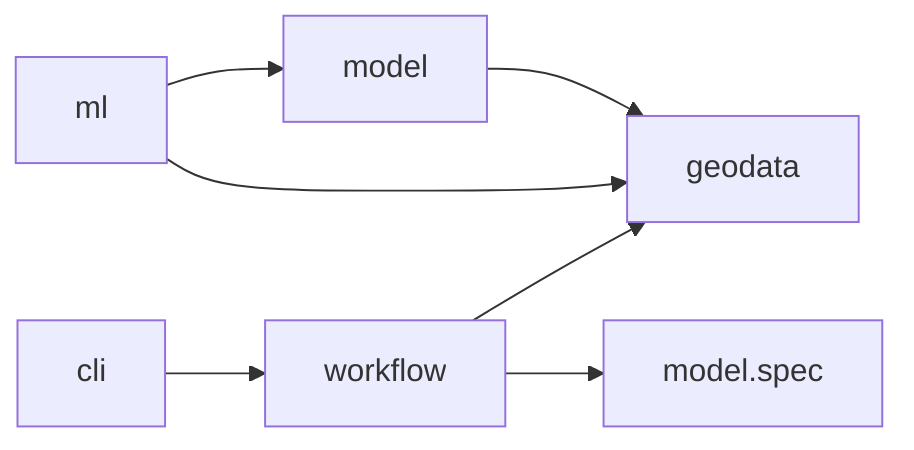

# Package ownership

```python
from geosave_engine import geodata as gs
from geosave_engine.geodata.benchmarks import dynamic_world
from geosave_engine.ml.segmentation import supervised
from geosave_engine.model.spec import ModelSpec
from geosave_engine.workflow.flows import prepare_dense_data
```

GeoSave composes native ecosystem objects. Raster readers return xarray objects;
vector readers return GeoDataFrames; training classes are Lightning classes.

| Package | Owns |
| --- | --- |
| `geodata` | Raster/vector accessors, metadata, public `io`, transforms, STAC, benchmark downloads, visualization. |
| `model` | Chain composition, registry, encoders, decoders, heads, model specifications, native releases. |
| `ml` | Lightning training behavior, task/method datasets and DataModules, builders, augmentation, training callbacks. |
| `workflow` | Serializable runtime configs, complete Prefect flows, reusable tasks. |
| `cli` | Command arguments, workspace creation, optional scaffolds. |
| `templates` | Files copied into generated consumer workspaces. |

Dependencies point from training toward model and data:



Importing geodata, model.spec, or workflow flows does not load torch. Model has
no dependency on ml. Some third-party encoder libraries load Lightning internally;
GeoSave's core chain, heads, registry, and release do not require it.

## Errors and warnings

```python
import warnings

from geosave_engine.geodata.errors import AnchorFetchError
from geosave_engine.geodata.warnings import GeoSaveWarning

warnings.simplefilter("error", GeoSaveWarning)
```

Use `TypeError` for unsupported object types, `ValueError` for invalid values
or incompatible data, and `KeyError` for missing mapping entries. Pydantic
validators raise `ValueError` so malformed specifications remain native
`ValidationError`s. `AnchorFetchError` identifies an empty STAC search separately
from transport and asset failures. `CollectionNotFoundError(LookupError)` lets
recipes try another catalog without swallowing a malformed response's `KeyError`.

Preserve dependency exceptions. Add context with `error.add_note(...)` and
re-raise the same exception. Cleanup handlers also re-raise after closing their
resources. Workflows and Lightning own retry and presentation policy.

Warnings describe operations that continue with data loss, an assumption, or
an incomplete result. Categories live in `geodata.warnings` and inherit from
`GeoSaveWarning`, including Lightning's incomplete validation warning. Emit
geodata warnings with Python's `skip_file_prefixes` set to GeoSave's package
paths so they point to the caller through accessors and nested transforms.

## Data and I/O

```python
from geosave_engine.geodata import io

scene = io.read_raster("scene.tif")
catalog = io.read_vector("samples.parquet")
```

Use format modules such as `io.geotiff`, `io.zarr`, and `io.geoparquet` for
format-specific options. Native `.gs` accessors preserve the fluent write APIs.
Raster operations remain lazy where possible; compute, reprojection, and
coordinate changes are explicit. Reader selection and assembly live in
`geodata.io.readers`; format modules own their file encodings, and
`geodata.io.raster.gdal` owns GDAL configuration. Dimension and coordinate names
live in `geodata.conventions`. Helpers shared across contexts, including
spatial Dask mapping in `utils/dask_mapping.py` and datetime handling, stay
in `geodata.utils`.

Raster features select named bands from one Dataset. Spectral indices decode
packing and nodata metadata on their selected bands before calculating:
variables without storage metadata are treated as reflectance.

```python
from geosave_engine.geodata import features

scene = scene.assign(
    ndvi=features.ndvi(scene, nir="B08", red="B04"),
    evi2=features.evi2(scene, nir="B08", red="B04"),
)
```

Cloud-mask functions expect decoded reflectance; prepare their inputs with
`scene.gs.mask_and_scale()`. Already decoded bands also work with spectral
indices, so one prepared Dataset can be shared across features.

The Dataset owns shared indexes. Features return unnamed DataArrays retaining
their grid and coordinates; assignment names the derived variable. Neighborhood
kernels use native Dask overlap and chunk alignment through `utils/dask_mapping.py`,
with an eager NumPy path for in-memory inputs.

Tensor conversion belongs to ML:

```python
from geosave_engine.ml.inputs import to_tensor

image = to_tensor(scene[["red", "nir"]], dtype="float32")
layers = to_tensor(sample)  # DataTree group names mapped to tensors
```

Geodata keeps native xarray and NumPy conversion and imports no Torch.
`to_tensor` preserves prepared pixel dtypes by default and reads NumPy-unsupported
Torch dtypes through float32. Model input assembly and target loading use the
same conversion.

Raster format modules own pixel writes and return the paths they wrote. STAC
Items are built from those saved files, each opened once for its header, kept
as a table, and read back through the same format readers:

```python
from geosave_engine.geodata import GeoVector, stac, stack

# A Collection exists on its own; Items are created into it.
forest = stac.create_collection("forest", description="Forest samples")

# The writer returns its files; each file states its own grid, bands and time.
paths = image.gs.to_cog("samples/forest")                      # one file per scene
items = stac.create_items(paths, collection=forest)            # one Item per scene
items = stac.create_items(image.gs.to_zarr("samples/forest.zarr"))   # one store, one Item

# Items are stored as one stac-geoparquet file, Collections in its metadata.
stac.table.write(items, "samples/catalog.parquet", collections=[forest])

# Rows are an ordinary GeoDataFrame: filter while reading, then with pandas or `gs`.
rows = stac.table.read("samples/catalog.parquet", bbox=bounds).gs.query(aoi)
forest_pixels = stac.table.load(stac.table.to_items(rows))     # lazy Dataset
collections = stac.table.read_collections("samples/catalog.parquet")

# A new batch is concatenated like any vector and the table written again.
more = stac.table.from_items(new_items)
stac.table.write(
    GeoVector.concat([stac.table.read("samples/catalog.parquet"), more]),
    "samples/catalog.parquet",
    collections=collections.values(),
    overwrite=True,
)

# A stack is one Item per group; its rows share `geosave:stack`.
sample = stack({"optical": optical, "label": label})
items = stac.create_stack_items(sample.gs.to_cog("samples/s0"), name="s0")
```

Dataset COG exports return `tuple[Path, ...]` and DataTree COG exports
`dict[str, tuple[Path, ...]]`: exactly the files the call wrote, excluding
unrelated files already in the destination. DataArray COG exports and Dataset
Zarr/NetCDF writes return one `Path`; deferred store writes resolve to it.
A DataTree is written as one store per group, `<destination>/<group>.zarr` or
`.nc`, and returns `dict[str, Path]`; `read_stack` reads that mapping, or the
folder in name order. A store never holds several groups, so every asset opens
by its href alone. Writers take no catalog argument.

The saved file is the one source an Item is built from. `stac.create_items`
opens each path lazily and groups the files covering one time into one Item;
`stac.create_item` builds one Item whose assets the caller names;
`stac.create_stack_items` does so for every group of a saved stack. An asset is
one file or store `read_raster` opens by its href. PySTAC builds it, and the
modules of `stac.extensions` write its fields, one module per schema, each
through that schema's PySTAC class: Projection for the grid, Raster and EO for
the bands, Classification for a legend, Zarr for a store's layout. An Item's id is its identity in the table and defaults
to the saved file's name; `create_items(paths, id="{lat:.2f}N_{start:%Y%m%d}")`
fills a `GeoAnchor.format` template per Item instead. An Item takes the id of
the Collection it is created into, except for a stack, where each group's name
is its collection. `table.write(..., collections=[...])` stores Collections in
the file's metadata with the extent their rows cover.

A table is also searchable like a STAC API. `StacClient.open` hands a Parquet
file or a folder of them to `StacTableClient`, which runs the same `StacQuery`
through rustac's DuckDB search and builds the same `StacSource`:

```python
client = stac.StacClient.open("samples/catalog")
items = client.search(stac.StacQuery(collections=["forest"]).set_filter("eo:cloud_cover <= 10"))
cube = client.source("forest").set_config(bands=["red", "nir"]).load(anchor)
```

Remote tables are read directly by rustac, including their stored Collection
metadata. For an S3-compatible endpoint, configure a native DuckDB session and
pass it to `StacClient.open`:

```python
import rustac

session = rustac.DuckdbClient()
session.execute("""
    CREATE SECRET (
        TYPE s3,
        KEY_ID 'your-access-key',
        SECRET 'your-secret-key',
        ENDPOINT 'localhost:9000',
        URL_STYLE 'path',
        USE_SSL false
    )
""")
client = stac.StacClient.open("s3://samples/catalog.parquet", duckdb=session)
```

DuckDB owns the [S3 secret configuration](https://duckdb.org/docs/stable/core_extensions/httpfs/s3api).
The table client adds no filesystem configuration or local copy of the table.
Asset loaders still use their own native storage configuration.

A source regrids through odc-stac, which does not read STAC 1.1 `bands`: over
a GeoSave table it loads `float32` with the fill value masked, and a
multi-band asset needs `stac_cfg` aliases. `stac.table.load` reads a GeoSave
table's files as they were stored.

PySTAC owns Items, Assets and their extension fields; stac-geoparquet owns the
Arrow conversion and the file format. Item properties become columns and asset
metadata stays nested under `assets`. `table.write` stores asset hrefs relative
to the table and `table.read` makes them absolute again, so a catalog moved
with its assets still opens. `table.write` also takes a table that was read and
edited, for example with a column of predictions.

GeoVector is a GeoDataFrame with an active geometry column and a CRS. It
requires no column and adds none: a file reads back with the columns it holds.
`gs` offers `crs`, `footprint`, `query`, `rasterize`, `concat`,
`from_geometry` and the format writers. `query` filters by space, and also by
time only where the target has a timespan and the frame carries `datetime`,
`start_datetime` or `end_datetime`; undated rows stay selectable. An anchor is
built by its own constructor,
`GeoAnchor.from_geometry(plots.gs.footprint, resolution=10)`, and
`prediction.gs.vectorize()` turns a flag raster into polygons.

An item table is a GeoVector that happens to carry `id`, `datetime` and
`assets`. A row is one raster: one scene for COGs, one store for Zarr and
NetCDF, and one group of a stack. A stack is composed in memory:

```python
rows = table.read("samples/catalog")
sample = rows[rows["geosave:stack"] == "s0"]
tree = stack(
    {name: table.load(part) for name, part in sample.groupby("collection")}
)
```

Ordinary vector I/O is GeoPandas and never infers STAC from column names. STAC
ItemCollection JSON is read with PySTAC and `table.from_items`.

Table readers apply each record's pixel window before combining sources.
`cuts.select(opened_sample, window)` applies a window's instants and pixels
to data already open. Sources on different grids, or holding one variable twice
at one instant, raise instead of being merged. Close the returned Dataset or
DataTree to release its source files.

Writers accept an fsspec URL in place of a local path. Zarr and GeoParquet go
through fsspec directly; COG and NetCDF are written locally and uploaded. A
remote write returns the URL it was given.

```python
forest.gs.to_zarr("hf://buckets/me/samples/forest.zarr")
paths = forest.gs.to_cog("s3://bucket/samples/forest", storage_options=options)
```

TIFFs are read with GDAL's own remote access (`s3://`, `gs://`, `az://`,
`https://`), set up with `configure_gdal`. A TIFF on a Hugging Face bucket is
read through the bucket's S3 gateway. That needs S3 keys generated from the HF
token (the login token itself is not accepted) and this setup, once per process:

```python
configure_gdal(
    aws_access_key_id="HFAK...",
    aws_secret_access_key="...",
    aws_default_region="us-east-1",
    aws_s3_endpoint="s3.hf.co",
    aws_virtual_hosting=False,
    gdal_disable_readdir_on_open="EMPTY_DIR",   # no listing, no sidecar probes
)
forest = read_raster("hf://buckets/me/samples/forest/forest_20250601T103031.tif")
```

The endpoint is process-wide, so TIFFs on AWS S3 and on a Hugging Face bucket
cannot be read in one process. NetCDF is read from local files only, and a
folder of COGs is scanned only locally.

The [catalog loop design](../superpowers/specs/2026-10-06-catalog-loop-design.md)
and the [remote storage design](../superpowers/specs/2026-10-06-remote-storage-design.md)
record these rules and their smoke tests.

`Palette` and `parse_color` are shared by metadata, persistence, visualization,
and training, so they live in `geodata.utils.color`. Workspace copying
lives in `cli.core.copy`; GDAL configuration owns its private omitted-value
sentinel. There is no root `utils` package.

STAC header factories describe loaded data. The STAC asset writer owns the
translation from saved variables to published band fields. `StacMetadata`
keeps optional source history: joins retain distinct records in encounter
order, and selecting a timestamp leaves that history intact. Exact duplicate
records collapse; records with the same ID but different captured metadata
remain. Use `StacSourceConfig.with_properties` for values such as sun azimuth
that need to follow the loaded time dimension.

Dataset-to-DataArray conversion reshapes pixels in the raster accessor.
`StackedAttrs.from_header` merges variable namespaces to obtain shared array
attrs and preserves the Dataset root and remaining variable attrs on the
`band` coordinate. Dataset and variable attrs never merge across scopes.
`StackedAttrs.to_header` restores the selected variables, applying current
array attrs to each one. Model aliases are normalized during conversion;
nodata is written as both `nodata` and `_FillValue`.

Zarr I/O records and restores Dataset variable order using the storage attr
`zarr_variable_order`; it is not a typed geodata model. Model raster requirements
select named variables in their declared order, independently of storage order.

The attrs scope registry maps configuration names to model classes. Parsed
namespaces use classes as keys, such as `{Nodata: Nodata(fill_value=0)}`;
models carry no `NAME` attribute. Parsing visits the registered models in
sequence; each reads the same flat attrs independently and validates its own
fields. Keys owned by no registered model in the scope remain foreign metadata.
`attr_keys()` lists a model's stored keys, while
`keys_for(field)` lists the aliases for one declared field. Names in YAML and
`rebase` keyword arguments resolve through the registry.

Raster factories require explicit dimensions: `raster({"red":
(("time", "y", "x"), pixels)}, grid, coords={"time": labels})` or
`array(pixels, grid, dims=("time", "y", "x"), coords={"time": labels})`.
Constructors use `y, x` for every CRS, with CF coordinate metadata describing
latitude/longitude or projected coordinates. Loaded objects keep their spatial
dimension names. Coordinates label dimensions independently of their order.
Native xarray construction checks ranks and shared lengths; GeoSave adds grid
placement.

Format writers own pixels and return paths. `stac.item` builds PySTAC objects
from a raster and those paths, `stac.extensions` writes each schema's fields
onto them, and `stac.table` owns the Parquet table. COG scenes are one Item each; stores are one Item and keep
their internal time axis.

`statistics()` returns a pandas DataFrame for both Dataset and DataArray.
Datasets have one row per variable; arrays with a `band` axis have one row per
labeled band. A single-band array uses its name as the row index, or None when
unnamed. Statistics eagerly read present pixels, excluding NaN and each
variable's nodata value. The shared implementation in `utils/statistics.py`
computes every variable's reductions together, so a common Dask source is read
once rather than once per band.

## Training and model release

A training setup keeps its Lightning Module and DataModule together:

```text
ml/segmentation/
├── callbacks.py
├── metrics.py
├── calibrate.py
├── transforms.py
└── supervised/
    ├── module.py
    └── data.py
```

The segmentation logger lives beside segmentation behavior because it renders
class masks and argmax logits. Method-specific datasets own targets and batches;
they do not live in model. The GeoVector tile-reference factory owns geometry metadata. Native Tiler and
Merger own pixel tiler and assembly; the training method owns validity and scoring.

ModelSpec owns raster requirements, preparation, frames, tiles, named raster
inputs, a row-based context recipe, and tensor transforms. Lightning configs own training settings and
augmentation. Scene validation/test reconstruct logits before scoring complete
rasters. This refactor preserves that behavior. Additional training methods,
head-owned interpretation, and the Panel explorer remain future work.

## Cuts: frames and chips as a table of windows

```python
from geosave_engine.geodata import cuts, stac

items = stac.table.read("data/train/items.parquet")
windows = cuts.stacks(items)                              # one whole window per saved sample
windows = cuts.frames(windows, 4, tolerance="10D")        # split in time
windows = cuts.chips(windows, 224, overlap=32)            # split in space
chip = cuts.select(sample, windows.iloc[0])               # lazy DataTree
```

A cut takes a table of windows and returns one, opening no file. `stacks`
reads each sample's grid and time labels off the item table through PySTAC's
Projection and Datacube classes; rows sharing `geosave:stack` are one sample
and must share one grid. Each row is one model input: `stack` names its
sample, `parent` the window it was cut from, `times` the instants it takes per
group, `row_off`, `col_off`, `height` and `width` its pixels, `crs` and
`transform` its own grid, and `chip` its number in its parent's layout.
Footprints use EPSG:4326.

The window table is a plain GeoDataFrame derived from the item table and the
model spec. It is model-specific, so it is recomputed, or written with
`gs.to_geoparquet` when a run wants to keep it. `ModelSpec` declares the cuts:
`spec.frames.cut(windows)` and `spec.chips.cut(windows)`.

`cuts.select(sample, window)` reads a window off an opened sample;
`select_times` and `select_pixels` do each half, which a dataset uses to
prepare a frame once and read many chips from it.

Partition references as separate `train.parquet` and `validation.parquet` files.
GeoSave does not generate a `split` column. Both are ordinary GeoDataFrames and
retain caller annotations. Asset pointers alone do not make a table STAC;
undated and pixel-only references remain ordinary GeoParquet. STAC Item tables
use the STAC GeoParquet writer. Relative assets resolve through `read_vector`.

Keep IDs beside tensors. Integer DataLoader positions are not persistent IDs;
datasets return reference IDs beside their input tensors. The parent rasters retain original target coordinates and metadata.
Saved reference IDs remain meaningful within their tiling snapshot, and callers
look them up rather than parsing them.

ModelChain composes native terminal results: a single result stays bare; multiple
results return under stage names. A terminal can be a Tensor or a native list,
dict, or tuple. This result contract adds no universal decoding or merging policy.

## Import migration

| Previous path | Current path |
| --- | --- |
| `geodata.utils.io` | `geodata.io` |
| `utils.file_ops.safe_copy` | `cli.core.copy.safe_copy` |
| `utils.colorize.Palette`, `parse_color` | `geodata.utils.color` |
| `ml.callbacks.DensePredictionLogger` | `ml.segmentation.callbacks.DensePredictionLogger` |
| GeoSave `Tiles`, `TileMerger` | Native `tiler.Tiler`, `tiler.Merger` |
| `Tiles.reference(...)`, `chip_windows(...)` | `cuts.chips(windows, size, overlap=...)` |
| `stack_frames(tree, ...)`, `FramesSpec.cut(tree)` | `cuts.frames(windows, ...)`, `FramesSpec.cut(windows)` |
| `crop_record(parent, row)` | `cuts.select_pixels(parent, window)` |
| `ChipsSpec.tiler(shape)` | `ChipsSpec.layout(shape)`, `cuts.layout(...)` |

The table's paths are relative to `geosave_engine`. Top-level geodata readers
remain available. Old paths have no compatibility aliases.


Each reference row carries a persistent sample ID, parent ID, and the native
integer `chip` within that parent. Dense prediction saves chip outputs under
those IDs with `ChipWriter`, and `cuts.merge` puts them back together:

```python
trainer = Trainer(callbacks=[ChipWriter("runs/predict/chips")])
trainer.predict(task, dataloaders=loader, return_predictions=False)

outputs = ChipWriter.read("runs/predict/chips")
merged = cuts.merge(frames, chips, outputs, taper=spec.chips.window)
```

Validation inside the training loop still merges live to score each raster
whole, on one device.

A layout is rebuilt, not stored: `cuts.layout(shape, size, overlap=..., mode=...)`
returns the same Tiler and halo every time, so a merge uses what a cut used.
`cuts.select_pixels(parent, windows.loc[id])` reads the row's bounded window
lazily, retaining leading axes and its exact grid. The rows of one sample
open through `stac.table.load`, one group at a time. Method-specific Datasets own tensor
conversion and targets; the shared `ml.datasets` package has been removed. The reference can be saved without
saving every tile as a separate raster.

Native pandas selection identifies catalog rows and `stac.table.load` opens
their saved assets; `cuts.select_pixels(parent, window)` applies a window to explicit native data. Pixel window slicing,
halo/fringe padding, and coordinate restoration live in `transform.chip.crop`;
this transform accepts native xarray data and pixel bounds independently of a
catalog. `cuts.chips` lists chip windows and each window states the time
labels of its groups in its `times` column without reading pixels. Asset opening and window application share native pixel transforms.

Supervised dataset setup adds an explicit native halo for overlapping tiles.
It passes the same widths to reference construction and native merger
unpadding. The segmentation method tracks completion and accumulates masked
logits plus coverage through native Merger with the same taper. Invalid values
do not dilute valid neighbours; uncovered output is excluded from scoring.
Parent-sized buffers are released when a scene completes.

Supervised batches are `(model_inputs, target, ids, valid)`. IDs preserve
scene/frame lineage through training augmentation. Validation/test blend logits
and retrieve original categorical labels from process-owned prepared parents;
labels never pass through numeric blending. Prediction batches and Lightning
`predict_step` remain `(model_inputs, ids)` and `(logits, ids)`.


Encoder `model_context(row)` functions encode per-raster timestamps and exact
sample grids. `ModelSpec.context` declares the function used in training and
inference; `ml.inputs.model_inputs(spec, rasters, row, context=...)` converts
rasters and optional explicit cached context to tensors. Catalogs retain native
annotations. Supervised runtime references retain `stack` as raw provenance;
they do not advertise the sample's paths as assets storing prepared pixels.
Use `cuts.select_pixels(parents[row.parent], row)` for prepared parents. A saved prepared raster can be registered with its own `assets`.

`ImageAugmenter` builds native Kornia pipelines from YAML `name`/`init_args`
entries, including nested pipelines and default crop sizes. Supply `data_keys`
when calling it with multiple tensors; a single image defaults to `input`.
Its `DataKey` type lists image, mask, box, keypoint, and class keys. `bbox_xyxy`
uses Pascal VOC pixel corners, `bbox_xywh` uses COCO pixel origin/size, and
`bbox_yolo` uses normalized
center/size. YOLO boxes are converted to pixel corners for Kornia and normalized
using the augmented image dimensions afterward; class IDs travel separately
under `class` or `label`. Training methods own box clipping and filtering. The
supervised DataModule owns when to apply them and how to keep temporal images
and targets aligned. Validation/test currently require a single device: ordinary
distributed tile sampling cannot complete each scene on one rank.

```python
from geosave_engine.ml.transforms import ImageAugmenter

augmenter = ImageAugmenter(
    [{"name": "RandomHorizontalFlip", "init_args": {"p": 0.5}}], size=256
)
pixels = augmenter(image)
pixels, moved_boxes = augmenter(image, boxes, data_keys=["input", "bbox_yolo"])
pixels, moved_mask = augmenter(image, mask, data_keys=["input", "mask"])
```
