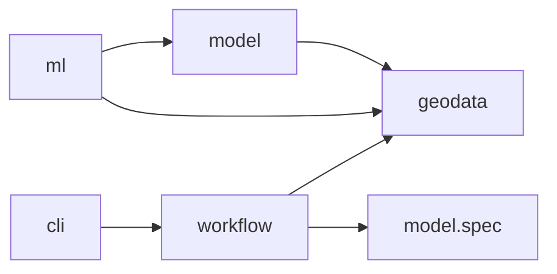

# Package ownership

```python
from geosave_engine import geodata as gs
from geosave_engine.geodata.benchmarks import dynamic_world
from geosave_engine.ml.segmentation import supervised
from geosave_engine.model.spec import ModelSpec
from geosave_engine.workflow.flows import prepare_dense_data
```

GeoSave composes native ecosystem objects. Raster readers return xarray objects;
vector readers return GeoDataFrames; training classes are Lightning classes.

| Package | Owns |
| --- | --- |
| `geodata` | Raster/vector accessors, metadata, public `io`, transforms, STAC, benchmark downloads, visualization. |
| `model` | Chain composition, registry, encoders, decoders, heads, model specifications, native releases. |
| `ml` | Lightning training behavior, task/method datasets and DataModules, builders, augmentation, training callbacks. |
| `workflow` | Serializable runtime configs, complete Prefect flows, reusable tasks. |
| `cli` | Command arguments, workspace creation, optional scaffolds. |
| `templates` | Files copied into generated consumer workspaces. |

Dependencies point from training toward model and data:



Importing geodata, model.spec, or workflow flows does not load torch. Model has
no dependency on ml. Some third-party encoder libraries load Lightning internally;
GeoSave's core chain, heads, registry, and release do not require it.

## Data and I/O

```python
from geosave_engine.geodata import io

scene = io.read_raster("scene.tif")
catalog = io.read_vector("samples.parquet")
```

Use format modules such as `io.geotiff`, `io.zarr`, and `io.geoparquet` for
format-specific options. Native `.gs` accessors preserve the fluent write APIs.
Raster operations remain lazy where possible; compute, reprojection, and
coordinate changes are explicit. Internal geodata helpers stay under
`geodata.utils`; public persistence lives under `geodata.io`.

Keep pixels in their native storage and their pointers in GeoParquet:

```python
from geosave_engine.geodata import read_stack, read_vector

scene = read_stack("input/")
# Process native xarray data before saving the result and its new pointers.
saved = scene.gs.to_cog(
    "dataset/sample-01", split_bands=True,
    catalog="dataset/catalog.parquet", id="sample-01",
)
sample = read_vector("dataset/catalog.parquet").iloc[0].gs.to_xarray()
```

`to_zarr("dataset/sample-01.zarr", catalog=..., id=...)` also supports a
multi-group stack (xarray >= 2026.4.0). Each named asset carries the store href and its `group`.
COG assets name a file or a group's directory of band/time leaves. Mixed COG
and Zarr assets can be registered with `GeoVector.from_assets(...)`. Registration
reads metadata lazily from saved assets; transformed values must be saved first.

Writers return their saved path. With `compute=False`, Zarr and NetCDF return a
delayed task resolving to that path. COG/Zarr writers with `catalog=` publish
the companion record after pixels finish. Companion
catalogs contain one record; use `GeoVector.concat` or `upsert` explicitly to
combine records. Existing catalogs require `overwrite=True`. Assets beneath the
catalog directory use relative hrefs on disk so both can move together.
Registration currently requires a shared georeferenced grid and time; a pixel
write followed by catalog publication is not an atomic transaction.

Palette definitions are metadata shared by persistence and visualization, so
`Palette` and `parse_color` live in `geodata.attrs.palette`. Workspace copying
lives in `cli.core.copy`; GDAL configuration owns its private omitted-value
sentinel. There is no root `utils` package.

## Training and model release

A training setup keeps its Lightning Module and DataModule together:

```text
ml/segmentation/
├── callbacks.py
├── metrics.py
├── calibrate.py
├── transforms.py
└── supervised/
    ├── module.py
    └── data.py
```

The segmentation logger lives beside segmentation behavior because it renders
class masks and argmax logits. Method-specific datasets own targets and batches;
they do not live in model. The GeoVector tile-reference factory owns geometry metadata. Native Tiler and
Merger own pixel layout and assembly; the training method owns validity and scoring.

ModelSpec owns raster requirements, preparation, frames, tiles, named raster
inputs, a row-based context recipe, and tensor transforms. Lightning configs own training settings and
augmentation. Scene validation/test reconstruct logits before scoring complete
rasters. This refactor preserves that behavior. Additional training methods,
head-owned interpretation, and the Panel explorer remain future work.

## Indexed tile context

```python
from geosave_engine.geodata import GeoVector
from geosave_engine.geodata.io import geoparquet

parents = {"scene-a": scene_a, "scene-b": scene_b}
layouts = {
    key: spec.tiles.layout(tuple(parent.sizes[d] for d in parent.gs.grid_dims))
    for key, parent in parents.items()
}
reference = GeoVector.from_layouts(parents, layouts)
geoparquet.write(reference, "reference.parquet", index=False)
lookup = geoparquet.read("reference.parquet").set_index("id", verify_integrity=True)
rows = lookup.loc[tile_ids]
```

Each ID names one tile of a prepared parent/frame, including its signed pixel
window and optional exact projection grid. Geographic footprints use EPSG:4326;
unreferenced rasters retain null geometry and projection fields. The reference is
a native GeoDataFrame, built without computing pixels. It is useful for raster
predictions, detections, classification, and embeddings; those results have
different assembly policies.

Keep IDs beside tensors. Integer DataLoader positions are not persistent IDs;
datasets return reference IDs beside their input tensors. The parent rasters retain original target coordinates and metadata.
Saved reference IDs remain meaningful within their tiling snapshot, and callers
look them up rather than parsing them.

ModelChain composes native terminal results: a single result stays bare; multiple
results return under stage names. A terminal can be a Tensor or a native list,
dict, or tuple. This result contract adds no universal decoding or merging policy.

## Import migration

| Previous path | Current path |
| --- | --- |
| `geodata.utils.io` | `geodata.io` |
| `utils.file_ops.safe_copy` | `cli.core.copy.safe_copy` |
| `utils.colorize.Palette`, `parse_color` | `geodata.attrs.palette` |
| `ml.callbacks.DensePredictionLogger` | `ml.segmentation.callbacks.DensePredictionLogger` |
| GeoSave `Tiles`, `TileMerger` | Native `tiler.Tiler`, `tiler.Merger` |
| `Tiles.reference(...)` | `GeoVector.from_layouts(parents, layouts, padding=...)` |
| `TilesSpec.cut(rasters)` | `TilesSpec.layout(shape)` |

The table's paths are relative to `geosave_engine`. Top-level geodata readers
remain available. Old paths have no compatibility aliases.


Each reference row carries a persistent sample ID, parent ID, and the native
integer `tile_id` within that parent. Dense prediction routes those IDs directly
into native mergers using the original layouts:

```python
from tiler import Merger

mergers = {key: Merger(layout, logits=classes) for key, layout in layouts.items()}
for sample_id, prediction in predictions:
    row = lookup.loc[sample_id]
    mergers[row.parent_id].add(int(row.tile_id), prediction)
```

Keep layout recipes and parent shapes with the job. Geometry and coordinate
spacing are not used to reconstruct pixel layouts. `reference.loc[id].gs.crop(parent)` reads the row's bounded window
lazily, retaining leading axes and its exact grid. A selected ordinary row
opens its full assets with `row.gs.to_xarray()`. Method-specific Datasets own tensor
conversion and targets; the shared `ml.datasets` package has been removed. The reference can be saved without
saving every tile as a separate raster.

Native pandas selection identifies a catalog row. `row.gs.to_xarray()` opens
its saved assets; `row.gs.crop(parent)` applies its window to explicit native data. Pixel window slicing,
halo/fringe padding, and coordinate restoration live in `transform.window.crop`;
this transform accepts native xarray data and pixel bounds independently of a
catalog. `transform.vector.from_layouts` builds reference rows from native layouts,
and `stac.item.raster_metadata` records band names and timestamp order without
reading pixels. Asset opening and window application share native pixel transforms.

Supervised dataset setup adds an explicit native halo for overlapping tiles.
It passes the same widths to reference construction and native merger
unpadding. The segmentation method tracks completion and accumulates masked
logits plus coverage through native Merger with the same taper. Invalid values
do not dilute valid neighbours; uncovered output is excluded from scoring.
Parent-sized buffers are released when a scene completes.

Supervised batches are `(model_inputs, target, ids, valid)`. IDs preserve
scene/frame lineage through training augmentation. Validation/test blend logits
and retrieve original categorical labels from process-owned prepared parents;
labels never pass through numeric blending. Prediction batches and Lightning
`predict_step` remain `(model_inputs, ids)` and `(logits, ids)`.


Encoder `model_context(row)` functions encode per-raster timestamps and exact
sample grids. `ModelSpec.context` declares the function used in training and
inference; `ml.inputs.model_inputs(spec, rasters, row, context=...)` converts
rasters and optional explicit cached context to tensors. Catalogs retain native
annotations. Supervised runtime references retain `source_id` and
`source_assets` as raw provenance; they do not advertise those paths as assets
storing prepared pixels. Use `row.gs.crop(parents[row.parent_id])` for prepared
parents. A saved prepared raster can be registered with its own `assets`.

`ImageAugmenter` builds native Kornia pipelines from YAML `name`/`init_args`
entries, including nested pipelines and default crop sizes. The supervised
DataModule owns when to apply them and how to keep temporal images and targets
aligned. Validation/test currently require a single device: ordinary distributed
tile sampling cannot complete each scene on one rank.
