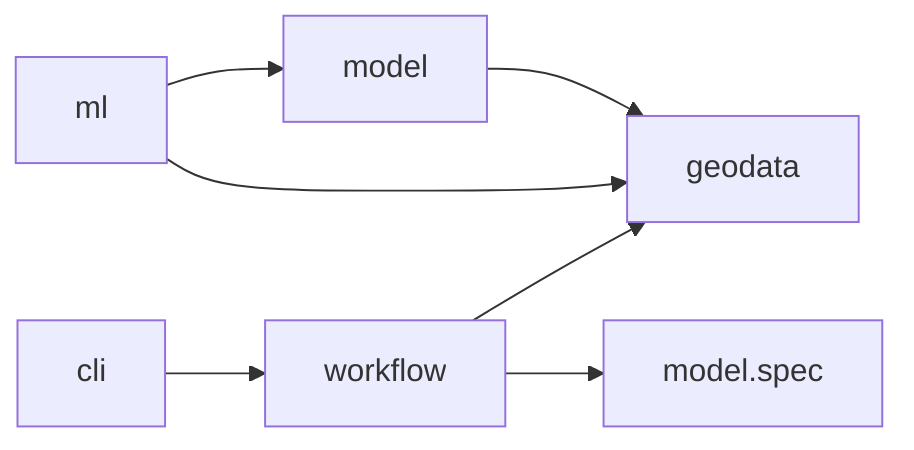

# Package ownership

```python
from geosave_engine import geodata as gs
from geosave_engine.geodata.benchmarks import dynamic_world
from geosave_engine.ml.segmentation import supervised
from geosave_engine.model.spec import ModelSpec
from geosave_engine.workflow.flows import prepare_dense_data
```

GeoSave composes native ecosystem objects. Raster readers return xarray objects;
vector readers return GeoDataFrames; training classes are Lightning classes.

| Package | Owns |
| --- | --- |
| `geodata` | Raster/vector accessors, metadata, public `io`, transforms, STAC, benchmark downloads, visualization. |
| `model` | Chain composition, registry, encoders, decoders, heads, model specifications, native releases. |
| `ml` | Lightning training behavior, task/method datasets and DataModules, builders, augmentation, training callbacks. |
| `workflow` | Serializable runtime configs, complete Prefect flows, reusable tasks. |
| `cli` | Command arguments, workspace creation, optional scaffolds. |
| `templates` | Files copied into generated consumer workspaces. |

Dependencies point from training toward model and data:



Importing geodata, model.spec, or workflow flows does not load torch. Model has
no dependency on ml. Some third-party encoder libraries load Lightning internally;
GeoSave's core chain, heads, registry, and release do not require it.

## Errors and warnings

```python
import warnings

from geosave_engine.geodata.errors import AnchorFetchError
from geosave_engine.geodata.warnings import GeoSaveWarning

warnings.simplefilter("error", GeoSaveWarning)
```

Use `TypeError` for unsupported object types, `ValueError` for invalid values
or incompatible data, and `KeyError` for missing mapping entries. Pydantic
validators raise `ValueError` so malformed specifications remain native
`ValidationError`s. `AnchorFetchError` identifies an empty STAC search separately
from transport and asset failures. `CollectionNotFoundError(LookupError)` lets
recipes try another catalog without swallowing a malformed response's `KeyError`.

Preserve dependency exceptions. Add context with `error.add_note(...)` and
re-raise the same exception. Cleanup handlers also re-raise after closing their
resources. Workflows and Lightning own retry and presentation policy.

Warnings describe operations that continue with data loss, an assumption, or
an incomplete result. Categories live in `geodata.warnings` and inherit from
`GeoSaveWarning`, including Lightning's incomplete validation warning. Emit
geodata warnings with Python's `skip_file_prefixes` set to GeoSave's package
paths so they point to the caller through accessors and nested transforms.

## Data and I/O

```python
from geosave_engine.geodata import io

scene = io.read_raster("scene.tif")
catalog = io.read_vector("samples.parquet")
```

Use format modules such as `io.geotiff`, `io.zarr`, and `io.geoparquet` for
format-specific options. Native `.gs` accessors preserve the fluent write APIs.
Raster operations remain lazy where possible; compute, reprojection, and
coordinate changes are explicit. Reader selection and assembly live in
`geodata.io.readers`; format modules own their file encodings, and
`geodata.io.gdal_env` owns GDAL configuration. Dimension and coordinate names
live in `geodata.conventions`. Helpers shared across contexts, including
xarray block mapping, color, and datetime handling, stay in `geodata.utils`.

Tensor conversion belongs to ML:

```python
from geosave_engine.ml.inputs import to_tensor

image = to_tensor(scene[["red", "nir"]], dtype="float32")
layers = to_tensor(sample)  # DataTree group names mapped to tensors
```

Geodata keeps native xarray and NumPy conversion and imports no Torch.
`to_tensor` preserves prepared pixel dtypes by default and reads NumPy-unsupported
Torch dtypes through float32. Model input assembly and target loading use the
same conversion.

Raster format modules own pixel writes and return the paths they wrote. A
catalog is built from those paths, and its rows read back through the same
format readers:

```python
# An unsaved raster is saved, then described as STAC Items. COG is the default
# driver: one Item per scene and one asset per band. Rows of one raster share
# its name as their `collection`.
items = image.gs.to_items("samples/forest")
# samples/forest/forest_20250601T103031/B04.tif, ...
items = image.gs.to_items("samples/forest.zarr", driver="zarr")   # one store, one Item

# A raster read from disk describes itself where it sits.
items = read_raster("samples/forest.zarr").gs.to_items()

# Items become rows; a table of Items is written as STAC GeoParquet.
catalog = GeoVector.from_items(items)
catalog.gs.to_geoparquet("samples/catalog.parquet")

# Rows are selected with pandas or a spatial query, then read lazily.
catalog = read_vector("samples/catalog.parquet")
forest = catalog.gs.query(aoi).gs.to_raster()

# A DataTree keeps its group names in the returned mapping, which read_stack
# accepts as it is.
group_paths = sample.gs.to_cog("samples/s0")
sample = read_stack(group_paths)

# Single-file and store writers return one Path.
store = image.gs.to_zarr("samples/forest.zarr")
```

Dataset COG exports return `tuple[Path, ...]` and DataTree COG exports
`dict[str, tuple[Path, ...]]`: exactly the files the call wrote, excluding
unrelated files already in the destination. DataArray COG exports and
Zarr/NetCDF writes return one `Path`; deferred store writes resolve to it.
Writers take no catalog argument; `to_items` forwards its options to the
writer its `driver` names.

Each path is one asset. `stac.asset.from_path` describes a saved file from its
own header: href, media type, grid, bands and time. `stac.item.from_paths`
groups the files of one write into scenes and names each Item after the path
its files share, so `samples/forest` yields `forest_20250601T103031`.
`stac.item.from_assets` builds one Item from assets the caller names, which is
how a training sample lists its layers:

```python
from geosave_engine.geodata import GeoVector
from geosave_engine.geodata.stac import asset, item

sample = item.from_assets(
    {
        "optical": asset.from_path("s0/optical.zarr"),
        "label": asset.from_path("s0/label.tif"),
    },
    id="s0",
)
row = GeoVector.from_items([sample]).iloc[0]
tree = row.gs.to_stack(layers=["optical", "label"])
```

PySTAC owns Items, Assets and their extension fields; stac-geoparquet owns the
Arrow conversion and STAC GeoParquet metadata. Item properties become columns
and asset metadata stays nested under `assets`. A table stores asset hrefs
relative to itself and `read_vector` makes them absolute again, so a catalog
moved with its assets still opens. Ordinary vector writes use GeoPandas and do
not infer STAC from column names.

`catalog.gs.to_raster()` and `row.gs.to_raster()` read data assets as one
raster through `read_raster`; `row.gs.to_stack()` reads one group per asset
through `read_stack`. Both row readers apply the row's pixel window, and
`row.gs.crop(opened_data)` applies it to data already open. Sources on
different grids, or holding one variable twice at one instant, raise instead of
being merged. Dense catalog preparation is still a skeleton.

Writers accept an fsspec URL in place of a local path. Zarr and GeoParquet go
through fsspec directly; COG and NetCDF are written locally and uploaded. A
remote write returns the URL it was given.

```python
forest.gs.to_zarr("hf://buckets/me/samples/forest.zarr")
paths = forest.gs.to_cog("s3://bucket/samples/forest", storage_options=options)
```

TIFFs are read with GDAL's own remote access (`s3://`, `gs://`, `az://`,
`https://`), set up with `configure_gdal`. A TIFF on a Hugging Face bucket is
read through the bucket's S3 gateway. That needs S3 keys generated from the HF
token (the login token itself is not accepted) and this setup, once per process:

```python
configure_gdal(
    aws_access_key_id="HFAK...",
    aws_secret_access_key="...",
    aws_default_region="us-east-1",
    aws_s3_endpoint="s3.hf.co",
    aws_virtual_hosting=False,
    gdal_disable_readdir_on_open=True,   # the gateway has no ListObjectsV1
)
forest = read_raster("hf://buckets/me/samples/forest/forest_20250601T103031.tif")
```

The endpoint is process-wide, so TIFFs on AWS S3 and on a Hugging Face bucket
cannot be read in one process. NetCDF is read from local files only, and a
folder of COGs is scanned only locally.

The [catalog loop design](../superpowers/specs/2026-10-06-catalog-loop-design.md)
and the [remote storage design](../superpowers/specs/2026-10-06-remote-storage-design.md)
record these rules and their smoke tests.

`Palette` and `parse_color` are shared by metadata, persistence, visualization,
and training, so they live in `geodata.utils.color`. Workspace copying
lives in `cli.core.copy`; GDAL configuration owns its private omitted-value
sentinel. There is no root `utils` package.

## Training and model release

A training setup keeps its Lightning Module and DataModule together:

```text
ml/segmentation/
├── callbacks.py
├── metrics.py
├── calibrate.py
├── transforms.py
└── supervised/
    ├── module.py
    └── data.py
```

The segmentation logger lives beside segmentation behavior because it renders
class masks and argmax logits. Method-specific datasets own targets and batches;
they do not live in model. The GeoVector tile-reference factory owns geometry metadata. Native Tiler and
Merger own pixel tiler and assembly; the training method owns validity and scoring.

ModelSpec owns raster requirements, preparation, frames, tiles, named raster
inputs, a row-based context recipe, and tensor transforms. Lightning configs own training settings and
augmentation. Scene validation/test reconstruct logits before scoring complete
rasters. This refactor preserves that behavior. Additional training methods,
head-owned interpretation, and the Panel explorer remain future work.

## Indexed tile context

```python
from geosave_engine.geodata.transform.chip import chip_windows
from geosave_engine.geodata.io import geoparquet

parents = {"scene-a": scene_a, "scene-b": scene_b}
tilers = {
    key: spec.chips.tiler(tuple(parent.sizes[d] for d in parent.gs.grid_dims))
    for key, parent in parents.items()
}
reference = chip_windows(parents, tilers)
geoparquet.write(reference, "reference.parquet", index=False)
lookup = geoparquet.read("reference.parquet").set_index("id", verify_integrity=True)
rows = lookup.loc[tile_ids]
```

Each ID names one tile of a prepared parent/frame, including its signed pixel
window and optional exact projection grid. Geographic footprints use EPSG:4326;
unreferenced rasters retain null geometry and projection fields. The reference is
a native GeoDataFrame, built without computing pixels. It is useful for raster
predictions, detections, classification, and embeddings; those results have
different assembly policies.

A reference may carry `assets` pointing to saved prepared parents. Opening
`reference.iloc[0].gs.to_stack()` applies its stored pixel window lazily.
`row.gs.crop(parent)` applies that same window to a supplied prepared parent.
After materializing a tile, its new catalog record points to the tile file and
has no parent window. `source_assets` remains provenance, not a substitute for
saved prepared pixels.

Partition references as separate `train.parquet` and `validation.parquet` files.
GeoSave does not generate a `split` column. Both are ordinary GeoDataFrames and
retain caller annotations. Asset pointers alone do not make a table STAC;
undated and pixel-only references remain ordinary GeoParquet. STAC Item tables
use the STAC GeoParquet writer. Relative assets resolve through `read_vector`.

Keep IDs beside tensors. Integer DataLoader positions are not persistent IDs;
datasets return reference IDs beside their input tensors. The parent rasters retain original target coordinates and metadata.
Saved reference IDs remain meaningful within their tiling snapshot, and callers
look them up rather than parsing them.

ModelChain composes native terminal results: a single result stays bare; multiple
results return under stage names. A terminal can be a Tensor or a native list,
dict, or tuple. This result contract adds no universal decoding or merging policy.

## Import migration

| Previous path | Current path |
| --- | --- |
| `geodata.utils.io` | `geodata.io` |
| `utils.file_ops.safe_copy` | `cli.core.copy.safe_copy` |
| `utils.colorize.Palette`, `parse_color` | `geodata.utils.color` |
| `ml.callbacks.DensePredictionLogger` | `ml.segmentation.callbacks.DensePredictionLogger` |
| GeoSave `Tiles`, `TileMerger` | Native `tiler.Tiler`, `tiler.Merger` |
| `Tiles.reference(...)` | `chip_windows(parents, tilers, padding=...)` |
| `ChipsSpec.cut(rasters)` | `ChipsSpec.tiler(shape)` |

The table's paths are relative to `geosave_engine`. Top-level geodata readers
remain available. Old paths have no compatibility aliases.


Each reference row carries a persistent sample ID, parent ID, and the native
integer `tile_id` within that parent. Dense prediction routes those IDs directly
into native mergers using the original tilers:

```python
from tiler import Merger

mergers = {key: Merger(tiler, logits=classes) for key, tiler in tilers.items()}
for sample_id, prediction in predictions:
    row = lookup.loc[sample_id]
    mergers[row.parent_id].add(int(row.tile_id), prediction)
```

Keep tiler recipes and parent shapes with the job. Geometry and coordinate
spacing are not used to reconstruct pixel tilers. `reference.loc[id].gs.crop(parent)` reads the row's bounded window
lazily, retaining leading axes and its exact grid. A selected ordinary row
opens its full assets with `row.gs.to_stack()`. Method-specific Datasets own tensor
conversion and targets; the shared `ml.datasets` package has been removed. The reference can be saved without
saving every tile as a separate raster.

Native pandas selection identifies a catalog row. `row.gs.to_stack()` opens
its saved assets; `row.gs.crop(parent)` applies its window to explicit native data. Pixel window slicing,
halo/fringe padding, and coordinate restoration live in `transform.chip.crop`;
this transform accepts native xarray data and pixel bounds independently of a
catalog. `transform.chip.chip_windows` lists chip windows from native tilers
and records each parent's band names and timestamp order in its
`raster_metadata` column without reading pixels. Asset opening and window application share native pixel transforms.

Supervised dataset setup adds an explicit native halo for overlapping tiles.
It passes the same widths to reference construction and native merger
unpadding. The segmentation method tracks completion and accumulates masked
logits plus coverage through native Merger with the same taper. Invalid values
do not dilute valid neighbours; uncovered output is excluded from scoring.
Parent-sized buffers are released when a scene completes.

Supervised batches are `(model_inputs, target, ids, valid)`. IDs preserve
scene/frame lineage through training augmentation. Validation/test blend logits
and retrieve original categorical labels from process-owned prepared parents;
labels never pass through numeric blending. Prediction batches and Lightning
`predict_step` remain `(model_inputs, ids)` and `(logits, ids)`.


Encoder `model_context(row)` functions encode per-raster timestamps and exact
sample grids. `ModelSpec.context` declares the function used in training and
inference; `ml.inputs.model_inputs(spec, rasters, row, context=...)` converts
rasters and optional explicit cached context to tensors. Catalogs retain native
annotations. Supervised runtime references retain `source_id` and
`source_assets` as raw provenance; they do not advertise those paths as assets
storing prepared pixels. Use `row.gs.crop(parents[row.parent_id])` for prepared
parents. A saved prepared raster can be registered with its own `assets`.

`ImageAugmenter` builds native Kornia pipelines from YAML `name`/`init_args`
entries, including nested pipelines and default crop sizes. Supply `data_keys`
when calling it with multiple tensors; a single image defaults to `input`.
Its `DataKey` type lists image, mask, box, keypoint, and class keys. `bbox_xyxy`
uses Pascal VOC pixel corners, `bbox_xywh` uses COCO pixel origin/size, and
`bbox_yolo` uses normalized
center/size. YOLO boxes are converted to pixel corners for Kornia and normalized
using the augmented image dimensions afterward; class IDs travel separately
under `class` or `label`. Training methods own box clipping and filtering. The
supervised DataModule owns when to apply them and how to keep temporal images
and targets aligned. Validation/test currently require a single device: ordinary
distributed tile sampling cannot complete each scene on one rank.

```python
from geosave_engine.ml.transforms import ImageAugmenter

augmenter = ImageAugmenter(
    [{"name": "RandomHorizontalFlip", "init_args": {"p": 0.5}}], size=256
)
pixels = augmenter(image)
pixels, moved_boxes = augmenter(image, boxes, data_keys=["input", "bbox_yolo"])
pixels, moved_mask = augmenter(image, mask, data_keys=["input", "mask"])
```
