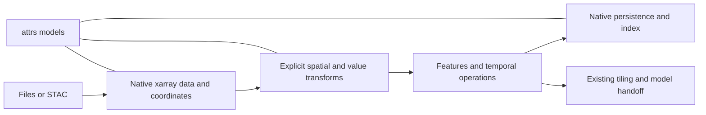

# Geodata data flow and ownership

This refactor follows the user's request to untangle geodata, remove stale code,
and implement improvements in order: attrs, core, STAC, transform, features,
pipeline. The acceptance flow uses existing native objects and operations:

```python
raw = source.load(anchor)
reflectance = raw[["red", "nir"]].gs.to_nan().gs.unpack()
derived = ndvi(reflectance, name="ndvi", red="red", nir="nir")
composite = derived.median("time", keep_attrs=True)
path = composite.gs.to_zarr("ndvi.zarr")
reopened = read_raster(path, chunks={})
```

## What users need

| User task | Required behavior | Owning module |
| --- | --- | --- |
| Find and load observations | Configured authentication, exact chosen bands and grid, lazy pixels, correct source identity | STAC and native format readers |
| Understand and edit metadata | Typed known fields, preserved unknown fields, consistent shared keys, failed edits leave data unchanged | attrs |
| Work with arrays, datasets, and stacks | Native xarray selection, explicit conversion, preserved scope and band identity | core |
| Prepare usable measurements | Explicit nodata masking and unpacking, explicit crop/warp/alignment, unchanged unrelated coordinates | transform |
| Derive indices and masks | Prepared physical inputs, agreeing grids, preserved acquisition coordinates, lazy spatial kernels | features |
| Combine observations | Explicit temporal aggregation/windowing, metadata describing the resulting coordinates and values | transform |
| Sample and reconstruct | Bounded tile reads, georeferenced reconstruction, merge continuous outputs before interpretation | existing tiling |
| Reuse results | Completed native format writes, round-trip metadata, portable manifest references | format writers and Manifest |

Users should not need to restore metadata after a pixel operation, coordinate
several metadata writers, or know which alias a dependency recognizes.

## Ownership and data flow



attrs interprets metadata; it never changes pixels. A source adapter translates
its external representation once. Core supplies native constructors and accessors;
accessors delegate numerical operations to transforms. Transforms own changes to
values, grids, and time. Features consume explicitly prepared observations.
Persistence encodes native objects. Workflow orchestration and model-specific
requirements stay outside geodata.

The implementation deepens existing Modules incrementally. Each step removes
duplication behind the observed failures while preserving the native Interface.
The completed steps and test evidence are recorded in the
[implementation plan](../plans/2026-09-23-geodata-dataflow.md).

## First implementation: attrs

Keep AttrsModel (field semantics), AttrsNamespace (one flat mapping), and
AttrsHeader (root/variable/coordinate scopes). They own different invariants.

Replace three mutation implementations with one flow:

1. Interpret header replacement, namespace patch, or ordered model patches.
2. Serialize the complete request and resolve every target before any mutation.
3. Prepare the resulting attrs mappings, then apply them together.

Shared keys inside one namespace must agree, including an explicit clear.
Contradictions raise instead of silently choosing model insertion order.
Ordered bare-model patches remain ordered; they express explicit edits rather
than simultaneous metadata claims. Namespace foreign values, including None,
keep their existing meaning. Header restoration preserves its replacement
semantics. No data arrays are computed or copied by these operations.

## Subsequent steps

- Core: jointly schedule scalar statistics; make Dataset/array metadata ownership
  explicit rather than reconstructing it by subtracting band keys.
- STAC: preserve caller-owned transport; use effective native band resolution and
  decoding for the output; keep raw source metadata as provenance.
- Transform: normalize nodata at the codec seam and retain unaffected native
  structure; update spatial/temporal metadata only where the operation changes it.
- Features: retain coordinates in derived arrays, reject implicit input alignment,
  and remove feature-owned automatic unpacking.
- Pipeline: remove unsupported publishing/update promises and validate the
  portable manifest path invariant; retain the working GeoParquet index.

Each step gets an executable regression or smoke test before its implementation
is settled. Representation changes are refined at their step against real callers.
No speculative storage hierarchy, expression registry, replacement raster type,
model schema, or orchestration framework is introduced.

## Constraints and verification

- Preserve unrelated working-tree changes; no automatic commits or branch changes.
- Use existing dependencies; no new dependency is required.
- Keep native xarray objects and lazy arrays in public Interfaces.
- Reprojection, resampling, casting, and eager computation remain explicit.
- Preserve applicable CRS, coordinates, spatial dimensions, transform, nodata,
  dtype, and band/variable identity.
- Persistence changes require round-trip tests; lazy operations require laziness checks.
- New checks use actual public behavior, real local files, and numerical examples.

The prior sweep recorded 429 passing geodata tests and additional reproductions.
That is baseline evidence, not evidence that this refactor passes.
